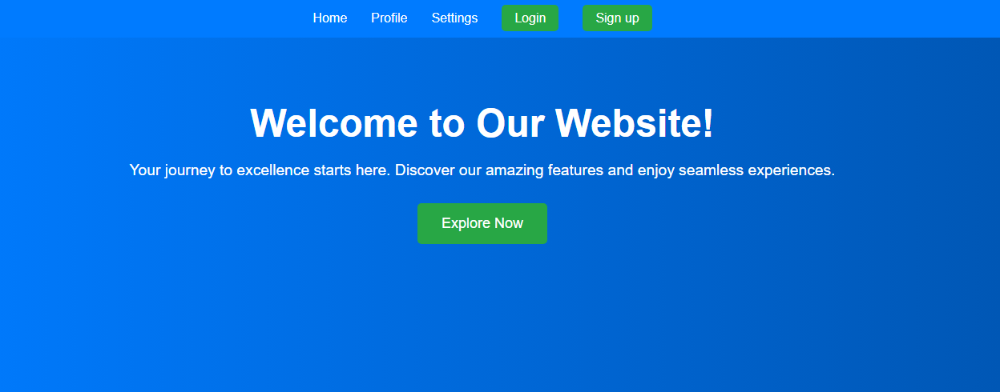
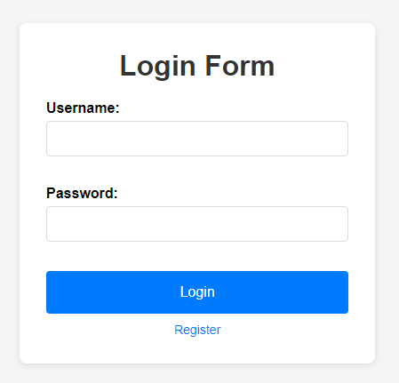

# User Authentication System

This project is a user authentication system built using Express.js, Mongoose, JWT, bcrypt, and EJS. It supports user registration, login, and logout functionalities with JWT-based authentication. The application uses environment variables for configuration and provides a simple interface for users to interact with.

## Features

- User Registration
- User Login
- User Logout
- JWT-based Authentication
- Password Encryption using bcrypt
- EJS templating for dynamic views

## Technologies Used

- **Express.js**: Web application framework for Node.js
- **Mongoose**: MongoDB object modeling tool
- **bcrypt**: Library to hash passwords
- **jsonwebtoken (JWT)**: Library to handle JSON Web Tokens
- **EJS**: Templating engine for rendering HTML
- **dotenv**: Module to load environment variables from a `.env` file

## Getting Started

Follow these instructions to get your development environment set up and running.

### Prerequisites

- Node.js and npm installed. [Download Node.js](https://nodejs.org/)
- MongoDB installed and running. [Download MongoDB](https://www.mongodb.com/try/download/community)
- Git installed (optional, for version control and cloning the repository).

### Installation

1. **Clone the repository**

   ```bash
   git clone https://github.com/inaveed-git/node_Authentication.git
   cd node_Authentication
   ```

2. **Install dependencies**

   ```bash
   npm install
   ```

3. ** A `.env` file**

   A `.env` file in the root directory and add the following variables:

   ```env
   MONGO_URI=mongodb://127.0.0.1:27017/UserData
   JWT_SECRET=your_jwt_secret
   COOKIE_MAX_AGE=900000
   PORT=5000
   ```

   Replace `your_jwt_secret` with a secure, random string for JWT secret.

4. **Run the application**

   ```bash
   npm start
   npm run div
   ```

   The server will start on port 5000 (or the port specified in the `.env` file).

## Routes

Here is a list of available routes in the application:

- **GET /**: Displays the home page. Shows login/logout button based on authentication status.
- **GET /home**: Displays the home page. Shows login/logout button based on authentication status.
- **GET /reg**: Displays the registration page where new users can sign up.
- **POST /reg**: Handles user registration. Accepts `username`, `email`, and `password` from the request body. Checks if the user already exists, hashes the password, and saves the user.
- **GET /login**: Displays the login page where existing users can log in.
- **POST /login**: Handles user login. Accepts `username` and `password` from the request body. Validates credentials, generates a JWT, and sets it as a cookie.
- **GET /logout**: Logs out the user by clearing the JWT cookie and redirects to the home page.

## Directory Structure

The project directory is organized as follows:

```
/your-repository
│
├── /config
│   └── db.js            # Database connection configuration
│
├── /models
│   └── User.js          # Mongoose user schema and model
│
├── /public              # Static assets like CSS and images
│
├── /views
│   ├── home.ejs         # EJS template for the home page
│   ├── login.ejs        # EJS template for the login page
│   └── register.ejs     # EJS template for the registration page
│
├── .env                 # Environment variables
├── index.js             # Main application file
├── package.json         # Project metadata and dependencies
└── README.md            # This file
```

## Example .env File

```env
MONGO_URI=mongodb://127.0.0.1:27017/UserData
JWT_SECRET=your_jwt_secret
COOKIE_MAX_AGE=900000
PORT=5000
```

## Example Screenshots

**Home Page:**



**Registration Page:**


**Login Page:**



## Contributing

1. Fork the repository.
2. Create a new branch (`git checkout -b feature-branch`).
3. Make your changes and commit (`git commit -am 'Add new feature'`).
4. Push to the branch (`git push origin feature-branch`).
5. Create a new Pull Request.

## License

This project is licensed under the MIT License - see the [LICENSE](LICENSE) file for details.

## Acknowledgements

- [Express.js](https://expressjs.com/)
- [Mongoose](https://mongoosejs.com/)
- [bcrypt](https://www.npmjs.com/package/bcrypt)
- [jsonwebtoken (JWT)](https://www.npmjs.com/package/jsonwebtoken)
- [EJS](https://www.npmjs.com/package/ejs)
- [dotenv](https://www.npmjs.com/package/dotenv)

---
